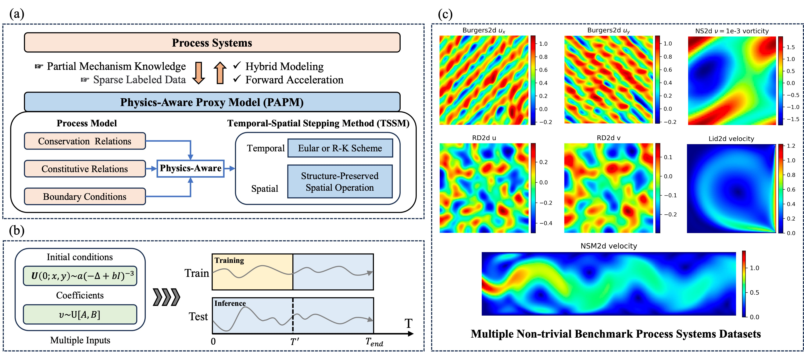

# PAPM: A Physics-aware Proxy Model for Process Systems

Process systems, which play a fundamental role in various scientific and engineering fields, often rely on computational models to capture their complex temporal-spatial dynamics. However, due to limited insights into the intricate physical principles, these models can be imprecise or inapplicable, coupled with a significant computational demand exacerbating inefficiencies. To address these challenges, we propose a **p**hysics-**a**ware **p**roxy **m**odel (**PAPM**) to explicitly incorporate partial prior mechanistic knowledge, including conservation and constitutive relations. Additionally, to enhance the inductive biases about strict physical laws and broaden the applicability scope, we introduce a holistic temporal and spatial stepping method (TSSM) aligned with the distinct equation characteristics of different process systems, resulting in better out-of-sample generalization. We systematically compare state-of-the-art pure data-driven models and physics-aware models, spanning five two-dimensional non-trivial benchmarks in nine generalization tasks. Notably, PAPM achieves an average absolute performance improvement of 6.4%, while requiring fewer FLOPs, and only 1% of the parameters compared to the prior leading method, PPNN. Through such analysis, the structural design and specialized spatio-temporal modeling schemes (i.e., TSSM) of PAPM exhibit not only the most balanced trade-off between accuracy and computational efficiency among all methods evaluated, but also an impressive out-of-sample generalization.



**The core contributions of this work are:**
- The proposal of PAPM, a novel physics-aware architecture design that explicitly incorporates partial prior mechanistic knowledge such as BCs, conservation, and constitutive relations. This design proves to be superior in terms of both training efficiency and out-of-sample generalizability.
- The introduction of TSSM, a holistic spatio-temporal stepping modeling method. It aligns with the distinct equation characteristics of different process systems by employing stepping schemes via temporal and spatial operations, whether in physical or spectral space.
- A systematic evaluation of state-of-the-art pure data-driven models alongside physics-aware models, spanning five two-dimensional non-trivial benchmarks in nine generalization tasks, as depicted. Notably, PAPM achieved an average absolute performance boost of 6.4%, requiring fewer FLOPs, and utilizing only 1%-10% of the parameters compared to alternative methods.
  
## Data
We employ five datasets spanning diverse domains, such as fluid dynamics and heat conduction. By analyzing the TSSM scheme employed by PAPM, we've categorized these datasets accordingly, offering a structured understanding of their roles.
- **Localized Category.**
  - **Burgers2d [1]** is a 2D benchmark PDE with periodic BC given by the equation $\frac{\partial \boldsymbol{u}}{\partial t}=-\boldsymbol{u} \cdot \nabla \boldsymbol{u}+ \nu \Delta \boldsymbol{u}+\boldsymbol{f}$. Here, $\boldsymbol{u}=(u_x, u_y)$ represents velocity. The aim is to predict subsequent frames of $\boldsymbol{u}$ under various initial conditions and viscosity $nu$ using the initial frames, while the forcing term $f$ remains unknown.
  - **RD2d [2]** corresponds to a 2D F-N reaction-diffusion equation with no-flow Neumann BC, $\frac{\partial \boldsymbol{u}}{\partial t}= \nu \Delta \boldsymbol{u}+\boldsymbol{f}$. Here, $\boldsymbol{u}=(u, v)$ are the activator and inhibitor, respectively. The goal is to project subsequent frames under diverse initial conditions from the initial frames, with the source term as unknown.
- **Spectral Category.**
  - **NS2d [3]** is a dataset for incompressible fluid dynamics in vorticity form with periodic BC. The equation is $\frac{\partial w}{\partial t}= -u\nabla w + \nu \Delta w + f$, where $u$ is velocity, $w$ is vorticity, and $f$ is an unknown forcing term. The objective is to predict final frames from the initial frames of vorticity $w$ under varied initial conditions.
- **Hybrid Category.**
  - **Lid2d** is a classical 2D dataset for incompressible lid-driven cavity flow with multiple BCs, $\frac{\partial \boldsymbol{u}}{\partial t}=-\boldsymbol{u} \cdot \nabla \boldsymbol{u}+ \nu \Delta \boldsymbol{u} - \nabla p$. The goal is to predict subsequent frames $(u,v,p)$ based on initial ones at differing viscosity $u$, assuming only two flows are known.
  - **NSM2d** is incompressible fluid dynamics with a magnetic field, described by $\frac{\partial \boldsymbol{u}}{\partial t}=-\boldsymbol{u} \cdot \nabla \boldsymbol{u}+ \nu \Delta \boldsymbol{u} - \nabla p + F$. The target is to predict subsequent frames of $(u,v,p)$ using the initial frames, with the forcing term $F$ as an unknown.


Dataset Link:
- Burger2d (from PDENet++'s experiments): [Burger2d]()
- RD2d (from PDEBench's experiments): [RD2d](https://darus.uni-stuttgart.de/file.xhtml?fileId=133017&version=5.0)
- NS2d (from FNO's experiments):  [NS2d](https://drive.google.com/drive/folders/1UnbQh2WWc6knEHbLn-ZaXrKUZhp7pjt-)
- Lid2d:  [Lid2d]()
- NSM2d:  [NSM2d]()

## 

### Get Start

Add dataset folder if it does not exist, ``mdkir datasets``, ``cd datasets``. To store training models, you can build the folder:``mkdir weights``. Then, move datasets to this folder. You might need to modify the `args` and `utils/load_data` functions for your custom datasets. 

**Data Format:**

The format of our dataset (Papm_Dataset) should be as follows:

```python
Dataset = [
    [Timestep1, X1, Y1],
    [Timestep2, X2, Y2],
   ...
]
Physics_Parameters = [
    [Param1],
    [Param2],
   ...
]

```
- **Timestep**: (N_steps) numpy array, time steps for this sample
    - N_theta: dimension of time steps for this dataset 

- **X,Y**: (X_dim x Y_dim) numpy array, representing input mesh points
- X_dim, Y_dim: input dimension of geometry

- **Physics_Parameters**: (N_steps x 1) numpy array, representing physics parameter the model need,i.e, ``Reynolds number``

- **Note:**
    - For a single dataset sample, The number of points must match, i.e, ``X.shape[0]=Y.shape[0]``, but it can vary with different dataset.
    - For physics parameters, the dimension must be the same as time_steps


### Training

To train PAPM model, parameters could be updated using argparser:

```python
python main.py --file_link='./datasets/burger_250_101_2_64_64.h5' --shuffle=True --model='lstm' --gpu='cuda:0' --dataset='burgers' --train_bs=4 --val_bs=2 --seed=2023 --epoches=500 --test_accumulative_error=True
```

### Code Structure

- ``main.py:`` main training function
- ``utils:`` includes dataset, loss functions
- ``models:`` folder for baselines and PAPM


## References
[1] Huang X, Li Z, Liu H, et al. Learning to simulate partially known spatio-temporal dynamics with trainable difference operators[J]. arXiv preprint arXiv:2307.14395, 2023.\
[2] Takamoto M, Praditia T, Leiteritz R, et al. PDEBench: An extensive benchmark for scientific machine learning[J]. Advances in Neural Information Processing Systems, 2022, 35: 1596-1611.\
[3] Li Z, Kovachki N, Azizzadenesheli K, et al. Fourier neural operator for parametric partial differential equations[J]. arXiv preprint arXiv:2010.08895, 2020.
